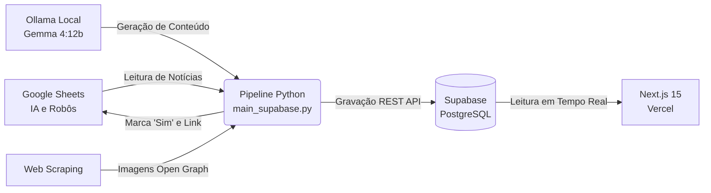

# 🌐 Portal Um Futuro Próximo

> Portal de notícias e artigos especializados em **Inteligência Artificial**, **Robôs Humanoides**, **Biotecnologia** e **Tecnologias Emergentes**, com autoria editorial de **Riccardo Malfer**.

🔗 **Site Oficial:** [https://umfuturoproximo.vercel.app](https://umfuturoproximo.vercel.app)  
🔐 **Painel Administrativo:** `/futuroadmin`

---

## 🏗️ Arquitetura do Sistema

O portal opera em uma arquitetura híbrida de alta performance e custo zero:



1. **Fontes de Dados (Google Sheets)**: Planilhas no Google Drive monitoram notícias de Inteligência Artificial e Robôs Humanoides.
2. **Inteligência Local (Ollama + Gemma 4:12b)**: Expande resumos curtos em artigos jornalísticos aprofundados, analíticos e formatados em HTML com a voz editorial de Riccardo Malfer.
3. **Extração de Mídia**: Busca e associa automaticamente a imagem principal de cada matéria via Open Graph / Twitter Cards.
4. **Banco de Dados (Supabase PostgreSQL)**: Armazena artigos com metadados, categorias, contagem de leitura, status e datas sincronizadas.
5. **Frontend (Next.js 15 na Vercel)**: Interface ultra-rápida, responsiva, com SEO otimizado, JSON-LD Schema.org e sitemap dinâmico. As notícias aparecem no site **imediatamente** após serem inseridas no Supabase (não requer novo deploy na Vercel).

---

## 📋 Estrutura da Planilha Google Sheets

O sistema consome duas planilhas oficiais configuradas em `config/settings.yaml`:
- **IA**: `sheet_ia` (Categoria: *Inteligência Artificial*)
- **Robôs**: `sheet_robos` (Categoria: *Robôs Humanoides*)

| Coluna | Campo | Descrição | Exemplo |
| :---: | :--- | :--- | :--- |
| **A** | **Data de Inclusão** | Data da notícia no formato `YYYY-MM-DD` | `2026-08-05` |
| **B** | **Título** | Título principal da reportagem | *OpenAI anuncia novos agentes...* |
| **C** | **Matéria** | Resumo ou texto base *(se vazio ou curto, o Ollama expande)* | *Texto descritivo...* |
| **D** | **Link** | URL da matéria de referência original | `https://techcrunch.com/...` |
| **E** | **Status / Blogger** | Preenchido automaticamente pelo sistema | Vazio = Pendente / `Sim` = Publicado |
| **F** | **PortalUrl** | Link público gerado para a notícia no portal | `https://umfuturoproximo.vercel.app/noticia/slug` |

---

## 🚀 Guia de Execução Diária

Para processar novas notícias das planilhas, gerar os artigos com IA e publicá-los no portal online:

### Método 1: Execução com 1 Clique (Recomendado)
Basta dar um duplo clique no arquivo:
```cmd
run_daily.bat
```
ou no terminal:
```bash
python main_supabase.py run
```
*O script verificará o Ollama, lerá até 5 notícias pendentes de cada planilha, gerará os artigos, subirá no Supabase e preencherá as URLs na planilha.*

---

### Método 2: Agendamento Automático Diário (Windows Task Scheduler)
Para que o computador execute o processo sozinho todos os dias (ex: às 09:00):

```bash
# 1. Criar a tarefa diária às 09:00
python setup_scheduler.py create --time 09:00

# 2. Verificar se a tarefa está ativa
python setup_scheduler.py check

# 3. Remover a tarefa (quando quiser desativar)
python setup_scheduler.py remove
```

---

### Método 3: Simulação (Dry Run)
Para ver o que seria publicado sem alterar o banco de dados nem as planilhas:
```bash
python main_supabase.py run --dry-run
```

---

## 🛠️ Comandos da CLI (`main_supabase.py`)

| Comando | Descrição |
| :--- | :--- |
| `python main_supabase.py run` | Executa o pipeline diário incremental (lê notícias pendentes e publica). |
| `python main_supabase.py run --max 10` | Executa o pipeline processando até 10 notícias por planilha. |
| `python main_supabase.py run --dry-run` | Modo simulação: testa a leitura e geração sem gravar no banco. |
| `python main_supabase.py sync-dates` | Sincroniza retroativamente as datas de publicação de todos os artigos no Supabase com base na coluna "Data de Inclusão". |
| `python main_supabase.py import-all` | Importa todas as linhas da planilha de uma só vez para o Supabase. |
| `python main_supabase.py test` | Testa a conexão com Google Sheets, Ollama Local e Supabase API. |

---

## 🔐 Painel Administrativo (`/futuroadmin`)

O portal conta com um painel administrativo protegido por senha no caminho:
👉 **`https://umfuturoproximo.vercel.app/futuroadmin`**

- **Criar Matéria Manualmente** (`/futuroadmin/novo`)
- **Editar e Excluir Artigos** (`/futuroadmin/editar/[id]`)
- **Marcar Artigo como Destaque (Hero)**
- **Central de Sincronização** (`/futuroadmin/sync`)
- **Segurança**: Rota oculta de rastreadores via `robots.txt` e desvinculada de menus públicos.

---

## 📁 Estrutura de Diretórios

```
blog/
├── app/                        # Rotas e páginas do Next.js 15 (App Router)
│   ├── categoria/[slug]/       # Páginas por categoria (IA, Robôs, Saúde, Startups)
│   ├── futuroadmin/            # Painel administrativo restrito
│   │   ├── editar/[id]/        # Edição de artigos existentes
│   │   ├── novo/               # Criação manual de artigos
│   │   ├── sync/               # Central de sincronização
│   │   └── page.tsx            # Dashboard administrativo
│   ├── noticia/[slug]/         # Página de leitura da matéria (SEO + JSON-LD)
│   ├── layout.tsx              # Layout global com Header e Footer
│   ├── page.tsx                # Página inicial (Home) com Hero e Feed
│   ├── robots.ts               # Diretivas do robots.txt para motores de busca
│   └── sitemap.ts              # Sitemap XML dinâmico gerado via Supabase
├── components/                 # Componentes React (Header, Footer, ArticleCard, HeroStory)
├── config/
│   ├── client_secret.json      # Credenciais OAuth do Google Cloud Console
│   └── settings.yaml           # Configurações do Supabase, Ollama, Planilhas e Agendador
├── data/
│   └── token.json              # Token OAuth persistido do Google
├── lib/
│   ├── supabase.ts             # Cliente do Supabase para o frontend Next.js
│   ├── types.ts                # Definições de tipos TypeScript
│   └── utils.ts                # Utilitários de formatação de datas e texto
├── logs/                       # Histórico detalhado de sincronização
├── src/                        # Núcleo do Pipeline Python
│   ├── auth.py                 # Autenticação Google OAuth2
│   ├── image_fetcher.py        # Web scraper de imagens Open Graph
│   ├── ollama_client.py        # Integração com LLM local (Gemma 4:12b)
│   ├── pipeline_supabase.py    # Orquestrador do fluxo Sheets -> Ollama -> Supabase
│   ├── sheets_reader.py        # Leitor e atualizador do Google Sheets
│   └── supabase_publisher.py   # Publicador e sincronizador REST no Supabase
├── supabase/
│   └── schema.sql              # Estrutura do banco de dados PostgreSQL e políticas RLS
├── main_supabase.py            # CLI principal do pipeline de notícias
├── run_daily.bat               # Script Windows executável com 1 clique
├── setup_scheduler.py          # Utilitário de agendamento no Windows Task Scheduler
├── package.json                # Dependências e scripts do Next.js
└── requirements.txt            # Dependências Python (requests, pyyaml, google-api, etc.)
```

---

## ⚙️ Configuração Inicial do Ambiente

### 1. Python (Pipeline de Ingestão)
```bash
pip install -r requirements.txt
```

### 2. Ollama (Geração Local de Matérias)
Certifique-se de que o Ollama está instalado e com o modelo Gemma baixado:
```bash
ollama pull gemma4:12b
ollama serve
```

### 3. Frontend Next.js (Desenvolvimento Local)
```bash
npm install
npm run dev
```
O portal local estará disponível em `http://localhost:3000`.

---

## ❓ Perguntas Frequentes (FAQ)

### As notícias sobem na Vercel automaticamente?
**Sim!** O portal na Vercel lê os dados em tempo real do banco de dados Supabase na nuvem. Assim que o script Python insere a notícia no Supabase, ela fica imediatamente visível para todos os visitantes do site sem necessidade de novo deploy na Vercel.

### E se o Ollama estiver desligado durante a execução?
O pipeline detecta automaticamente a ausência do Ollama e usa o resumo original presente na coluna "Matéria" da planilha, publicando normalmente sem interromper o fluxo.

### O que fazer se uma notícia foi publicada com data errada?
Basta rodar `python main_supabase.py sync-dates` para sincronizar as datas do banco com as planilhas em segundos.
